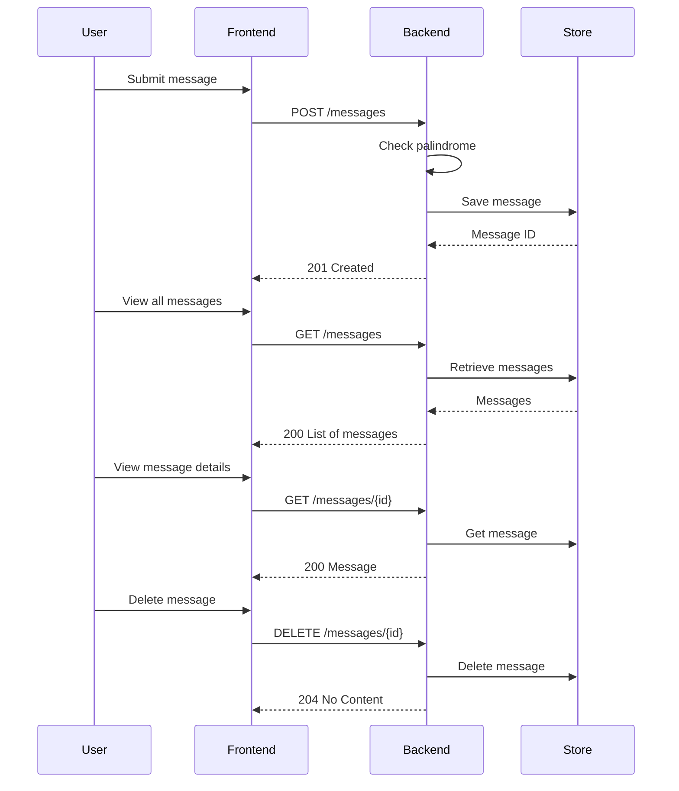

# Palindrome Checker App

A full-stack application that lets users submit words and checks if they are palindromes.  
The app provides a REST API and a simple UI for interacting with stored messages.

---

## 🌍 Live Demo

**Frontend**: [https://qlikpalindrom.z16.web.core.windows.net/](https://qlikpalindrom.z16.web.core.windows.net/)  
**API Docs**: [https://qlik-backend.orangesky-3031b73d.northeurope.azurecontainerapps.io/docs](https://qlik-backend.orangesky-3031b73d.northeurope.azurecontainerapps.io/docs)

> ⚠️ **Note:** The backend runs on [Azure Container Apps](https://learn.microsoft.com/en-us/azure/container-apps/), which may scale down to zero after periods of inactivity.  
> This means the first request after some idle time may take a few seconds due to cold start.

---

## 🧰 Requirements

- Docker + Docker Compose
- Make (optional, but recommended)
- Python 3.11.6 + Pipenv
- Node.js
- PyEnv (optional, but recommended)

---

## 📁 Repository Structure

```
.
├── backend/         # FastAPI backend service
├── frontend/        # React frontend service
├── local_env/       # Local Docker Compose setup
├── prod_env/        # Production infrastructure (Terraform on Azure)
├── Makefile         # Top-level common tasks
├── README.md        # Project documentation
├── env.make.sample  # Sample environment configuration
```

Each subproject includes its own `Makefile` for convenience.

---

## ▶️ Run the App Locally

> ℹ️ Before running, make sure to create `env.make` files from the provided `env.make.sample` files in the following directories:  
> `local_env/`, `backend/`, and `frontend/`.  
> Also create a `.env` file in the `backend/` folder from the provided `.env.sample`.

The local environment uses Docker Compose to start both backend and frontend.

```bash
cd local_env
make compose-up
```

- Frontend: http://localhost:3000  
- Backend: http://localhost:8000

To stop:

```bash
make compose-down
```

---

## ☁️ Provision Production Environment

Infrastructure is defined using Terraform and provisioned on Azure.

```bash
cd prod_env
make terraform-init    # One-time initialization
make terraform-plan    # Preview infrastructure changes
make terraform-apply   # Apply infrastructure changes
```

Remote Terraform state is stored in Azure Blob Storage.

---

## 🔧 Development Tasks

Common tasks per subproject:

### `backend/`

```bash
make pipenv-install          # Install dependencies
make pipenv-run              # Run the app locally
make pipenv-flake            # Lint Python code with flake8
make pipenv-black            # Format Python code with black
make pipenv-test             # Run all tests (unit + integration)
make pipenv-test-unit        # Run unit tests
make pipenv-test-integration # Run integration tests
make azure-deploy            # Deploy to Azure Container Apps
```

### `frontend/`

```bash
make npm-start           # Start frontend in dev mode
make npm-lint            # Lint frontend code with ESLint
make npx-format          # Format frontend code with Prettier
make npm-build           # Build production bundle
make azure-deploy        # Deploy to Azure Static Web Apps
```

### `local_env/`

```bash
make compose-up          # Start local Docker environment
make compose-down        # Tear down local stack
```

### `prod_env/`

```bash
make terraform-init      # Initialize Terraform (first time)
make terraform-plan      # Show planned changes
make terraform-apply     # Apply infrastructure changes
```

Run `make` in any directory to see available commands.

---

## 🔄 System Overview

This sequence diagram outlines how the system components interact:



---

## 📚 REST API Reference

Available once backend is running:

- Swagger UI: `http://localhost:8000/docs`
- OpenAPI JSON: `http://localhost:8000/openapi.json`

> Live docs is available at: [https://qlik-backend.orangesky-3031b73d.northeurope.azurecontainerapps.io/docs](https://qlik-backend.orangesky-3031b73d.northeurope.azurecontainerapps.io/docs)

### Endpoints

| Method | Path               | Description                         |
|--------|--------------------|-------------------------------------|
| POST   | `/messages`        | Submit a new message                |
| GET    | `/messages`        | List all submitted messages         |
| GET    | `/messages/{id}`   | Retrieve message + palindrome check |
| DELETE | `/messages/{id}`   | Delete a specific message           |

---

## 🧪 Tests

All backend tests are run using `make` targets from the `backend/` directory:

```bash
make pipenv-test             # Run all tests (unit + integration)
make pipenv-test-unit        # Run only unit tests
make pipenv-test-integration # Run only integration tests
```

Unit tests cover domain logic and use case actions.  
Integration tests verify the full REST API using FastAPI’s `TestClient`.

No external infrastructure is required — all tests use in-memory components.

---

## 🧱 Clean Code & Architecture

The backend follows clean architecture principles for clarity, testability, and separation of concerns:

- **Actions** encapsulate application use cases (one per route).
- **Domain services** contain business logic (`MessageService`).
- **Stores** abstract persistence behind an interface (`IMessageStore`).
- **Dependency injection** is used explicitly in route handlers to construct actions and services, keeping components loosely coupled and easy to test.

This structure allows for easy replacement of infrastructure (e.g., swapping in a database-backed store) while keeping the core logic untouched.

---

## 🧹 Code Formatting & Linting

The codebase includes linting and formatting tools for both backend and frontend:

- **Backend (Python)**: Uses `flake8` for linting and `black` for formatting.
  ```bash
  make pipenv-flake     # Lint Python code
  make pipenv-black     # Auto-format Python code with black
  ```

- **Frontend (React/JS)**: Uses `eslint` for linting and `prettier` for formatting.
  ```bash
  make npm-lint          # Lint frontend code
  make npx-format        # Format frontend code
  ```

Consistent code style can be enforced across the project to maintain clarity.

---

## ⚖️ License

This project is released under the MIT License.  
See the `LICENSE` file for full details.

---

## 👤 Author

Created by [David Runemalm](https://www.davidrunemalm.com)  
As part of a technical assignment for Qlik.
